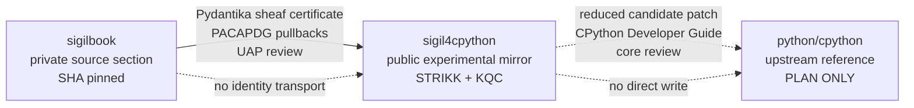
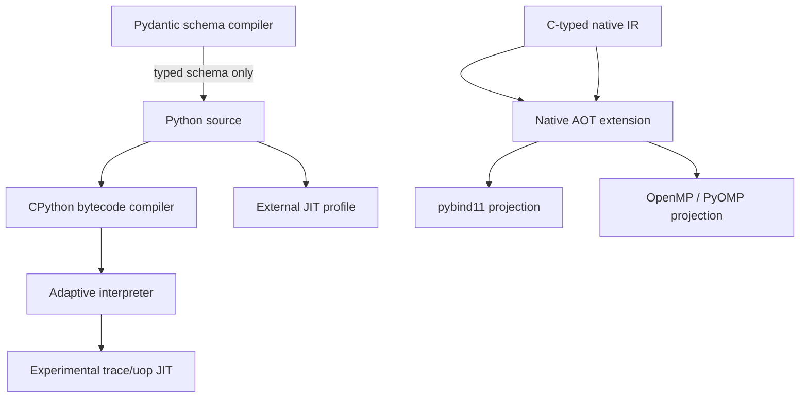
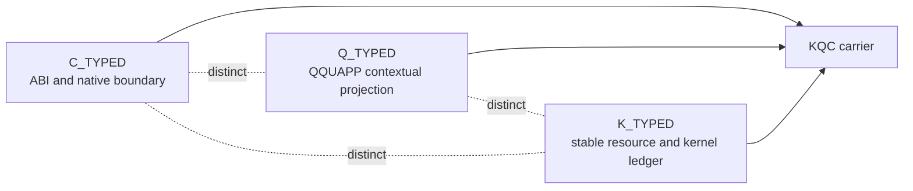
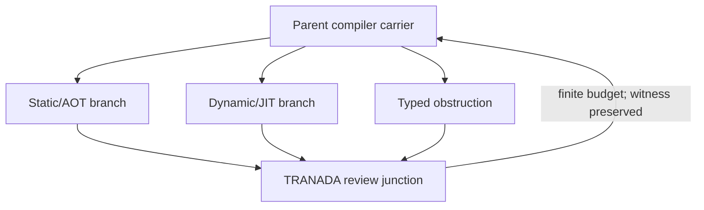
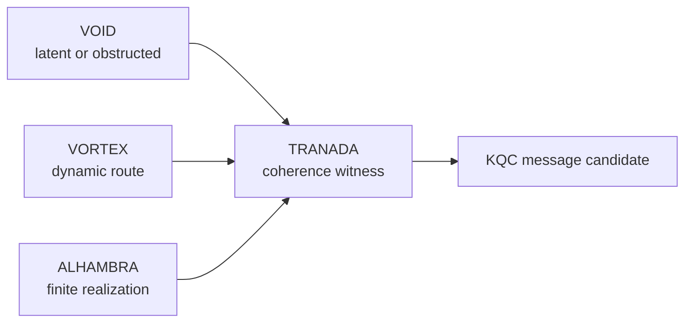

# STRIKK KQC publication sheaf V1

```yaml
id: STRIKK_KQC_PUBLICATION_SHEAF_V1
author: Jara Juana Bermejo Vega
attribution: JJBV
status: public_review_candidate
source_repository: jbermejovega/sigilbook
public_mirror: jbermejovega/sigil4cpython
upstream_reference: python/cpython
upstream_authority: PLAN_ONLY
```

## Repository sheaf



## Compiler classification



## KQC facets



## Third Wheel recursion



## VOID / VORTEX / ALHAMBRA router



## Hard boundaries

```text
sigilbook != sigil4cpython != python/cpython
publication sheaf != file copy
public mirror != upstream acceptance
Pydantic != standard-library dependency
DisCoPy plan != compiler execution
Lean4 scaffold != quotient/TQFT theorem
K^0(pt) = Z != VOID is a standard dual of the point
JIT profile != observed JIT execution
Third Wheel decomposition != theorem for all total categories
aperiodic compression programme != established compression theorem
```
